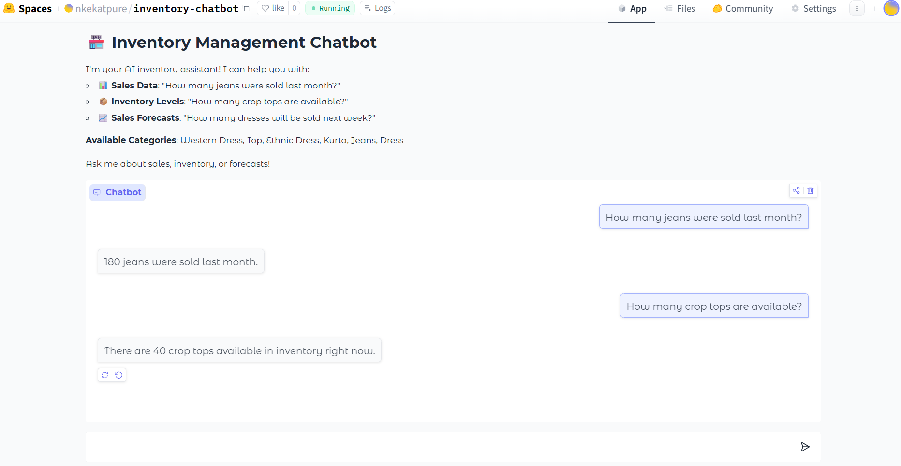

# Inventory Management Chatbot
A Flask chatbot application powered by OpenAI's GPT-3.5 Turbo APIs, bridges the gap between complex data analysis and user-friendly interaction. It supports queries on inventory levels, sales forecasts, and more, directly integrating with our database. Integrating linear regression forecasting methods. Additionally, it features a user-friendly chatbot UI written in HTML.

## Live Demo

Try the app now: https://huggingface.co/spaces/nkekatpure/inventory-chatbot

## Forecast.py
The approach integrates two sophisticated linear regression models, trained to predict future sales based on historical data. One model focuses on item-level predictions, while the other specializes in category-level forecasts, allowing for tailored insights depending on the granularity required.

Here's a breakdown of how the system operates:

Model Loading: The LinearRegression algorithm from scikit-learn and use joblib to load our pre-trained models—one for items (linear_regression_model.pkl) and another for categories (linear_regression_model_category.pkl).

Data Handling: Chatbot can predict future sales for both individual items and broader categories. Depending on the user's query, it fetches historical sales data and uses it to make informed predictions.

Dynamic Forecasting: The core function, predict, dynamically adapts to the user's request—whether for a specific item or a category. It processes the input, retrieves relevant historical data, and applies the appropriate model to predict next week's sales.

User-Friendly Outputs: The chatbot rounds up the prediction to the nearest whole number, ensuring the forecast is practical and easily interpretable for inventory planning.

This project not only showcases our capability to integrate AI with practical applications but also represents a significant step towards optimizing inventory management, making operations more efficient, and helping businesses plan their inventory needs with unprecedented accuracy.
## ReadData.py
Data Cleansing and Standardization: Begin with meticulous preprocessing, focusing on essential columns such as date, SKU, quantity, and category. Standardize date formats and implement a unified date counter for consistent analysis.

Moving Average Computation: Utilize Python to calculate moving averages spanning from 3 to 30 days. Optimize forecasting accuracy by capturing underlying sales trends and patterns.

Model Training and Deployment: Leverage scikit-learn to train a Linear Regression model, predicting future sales based on historical data. Seamlessly deploy the model using joblib, ensuring operational efficiency.

Data Visualization and Reporting: Generate comprehensive reports, including SKU-level order data and item details, providing stakeholders with actionable insights for informed decision-making in inventory planning and management.

Enhanced User Experience: Incorporate random quantity generation to simulate real-world inventory scenarios, enabling robust testing and validation of inventory management strategies.
## dbConnector.py

Title: Empowering Data-Driven Decision-Making in Inventory Management

Unlock the potential of data analytics and machine learning to revolutionize inventory management with these critical functions:

Database Connectivity: Seamlessly connect to your MySQL database using Python's mysql.connector module. Efficiently manage connections, execute queries, and retrieve data with ease.

Inventory Querying: Implement functions to fetch real-time inventory data based on item categories or SKUs. Utilize SQL queries to aggregate and summarize inventory information, enabling informed decision-making.

Date Manipulation: Leverage Python's datetime module to perform date calculations dynamically. Calculate the number of days passed in the current week and determine the date of the upcoming Saturday for precise data analysis.

Machine Learning Model Integration: Integrate trained Linear Regression models for accurate sales forecasting. Utilize joblib to load pre-trained models, enabling quick predictions based on new input data.

Predictive Analytics: Predict future sales trends based on historical data and category-specific insights. Utilize machine learning models to forecast sales volumes for specific items or product categories.

Scalable Solutions: Ensure scalability by designing functions that can handle varying data inputs and adapt to evolving business requirements. Enable seamless integration with existing inventory management systems for enhanced operational efficiency.

Error Handling: Implement robust error-handling mechanisms to manage unexpected scenarios, ensuring uninterrupted functionality and reliability of inventory management processes.
## App.py

Chat Interface: Utilizing Flask, the project offers a user-friendly chat interface where inventory managers can interact with the chatbot to obtain insights and perform various inventory-related tasks.

AI-Powered Conversational Agent: The chatbot is equipped with OpenAI's GPT-3.5 Turbo model, enabling it to understand user queries, provide contextually relevant responses, and handle complex conversations with natural language processing capabilities.

Database Connectivity: The chatbot seamlessly connects to MySQL databases using the mysql.connector module, allowing real-time access to inventory data for accurate decision-making.

Inventory Analytics: Users can query the chatbot for inventory-related information such as available quantity, sales history, and future forecasts for specific items or categories.

Predictive Analytics: Leveraging machine learning models, the chatbot can forecast future sales trends and inventory requirements based on historical data, helping inventory managers optimize stock levels and avoid shortages.

Role Impersonation: The chatbot can impersonate the role of an inventory manager, understanding user requests related to sales, forecasting, and inventory status. It categorizes user queries and responds accordingly, ensuring efficient communication.

Dynamic Response Generation: The chatbot dynamically generates responses in JSON format, providing structured information to users and enhancing readability and usability.

